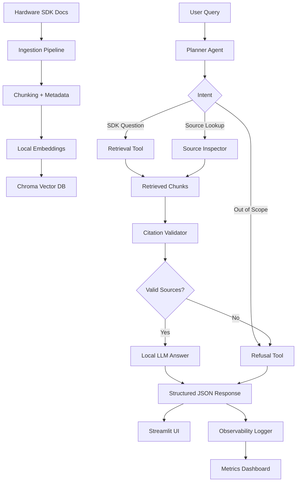

# Local SDK RAG Assistant

A private local Retrieval-Augmented Generation assistant for hardware SDK documentation.

This project lets you chat with SDK manuals, API references, code examples, and troubleshooting guides using a local LLM.

## Demo Document

For the public demo, this project uses the official Raspberry Pi Pico C/C++ SDK documentation PDF.

Private SDK files should be placed in:

```text
docs/private/
```

Public demo docs can be placed in:

```text
docs/public/
```

## Tech Stack

- Python
- uv
- Streamlit
- LangChain
- Ollama
- ChromaDB

## Models

```text
LLM: llama3:latest
Embeddings: nomic-embed-text:latest
```

## Setup

### 1. Create environment

```bash
uv venv
source .venv/bin/activate
```

### 2. Install dependencies

```bash
uv sync
```

Or install manually:

```bash
uv add streamlit langchain langchain-community langchain-ollama langchain-chroma langchain-text-splitters chromadb pypdf
```

### 3. Pull Ollama models

```bash
ollama pull llama3:latest
ollama pull nomic-embed-text:latest
```

### 4. Download public demo SDK PDF

```bash
mkdir -p docs/public

curl -L "https://pip.raspberrypi.com/documents/RP-009085-KB-raspberry-pi-pico-c-sdk.pdf" \
  -o docs/public/raspberry-pi-pico-c-sdk.pdf
```

### 5. Build vector database

```bash
uv run python ingest.py --reset
```

### 6. Run Streamlit app

```bash
uv run streamlit run app.py
```

## Example Questions

```text
How do I initialize GPIO in the Pico SDK?
How do I configure UART?
What APIs are available for I2C?
How do I use PWM?
What is the setup flow for a Pico C SDK project?
Give me an example of blinking an LED.
What functions are used for SPI communication?
```

## Privacy

- Local LLM runs through Ollama.
- Embeddings are generated locally.
- Vector database is stored locally in `db/`.
- Private SDK files inside `docs/private/` are ignored by Git.
## Project Structure

```text
local-sdk-agent/
├── app.py                     # Main Streamlit chat UI
├── ingest.py                  # Document ingestion pipeline
├── rag.py                     # Core RAG logic: vector DB, context formatting, LLM answer generation
├── agent.py                   # Agentic workflow: planner, routing, validation, structured response
├── tools.py                   # Agent tools: retrieval, citation validation, refusal, metrics
├── observability.py           # Logging utilities for latency, retrieval scores, tokens, failures
├── dashboard.py               # Streamlit observability dashboard
├── config.py                  # Central configuration for models, paths, chunking, thresholds
├── pyproject.toml             # uv project dependencies
├── uv.lock                    # Locked dependency versions
├── README.md                  # Project documentation
├── .gitignore                 # Prevents private docs, vector DB, env files from being committed
├── .python-version            # Python version used by uv
│
├── docs/
│   ├── public/                # Public demo SDK documentation
│   │   └── raspberry-pi-pico-c-sdk.pdf
│   └── private/               # Private SDK docs, ignored by Git
│       └── .gitkeep
│
├── db/                        # Local Chroma vector database, ignored by Git
│
├── logs/
│   └── rag_logs.jsonl         # Observability logs, ignored or optionally committed for demo
│
├── eval/
├── screenshots/
└── assets/
```
## Architecture

