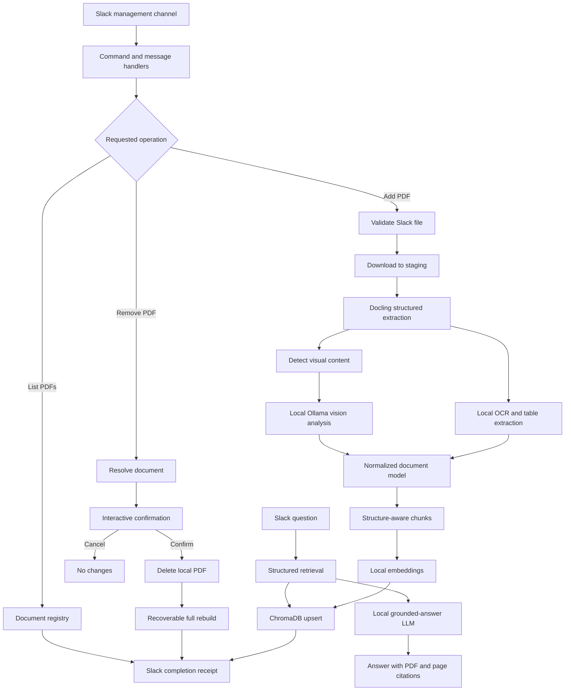

# Local Multimodal PDF Ingestion and Slack Management Design

## Objective

Extend the local SDK RAG assistant so it can extract and retrieve text, document structure, tables, scanned content, figures, screenshots, and image-based walkthroughs from PDFs. Add Slack workflows that let members of one configured management channel add, list, and remove PDFs while keeping document processing, vision analysis, embeddings, and storage local.

The system must continue refusing answers when the indexed evidence is insufficient. Multimodal extraction improves coverage but does not guarantee that every possible question can be answered correctly.

## Scope

This change includes:

- Structure-aware PDF extraction using Docling.
- Local OCR and local vision enrichment for visually significant pages and figures.
- Structure-aware chunking with page-level provenance.
- Incremental indexing of newly added PDFs.
- Full, recoverable database rebuild after PDF removal.
- Slack commands and natural-language attachment handling.
- Management-channel authorization and interactive deletion confirmation.
- A persistent local document registry and ingestion job state.
- Automated unit, integration, and end-to-end tests.

This change does not include cloud OCR, cloud vision APIs, general document formats other than PDF, a web-based administration interface, or per-user authorization rules inside the management channel.

## Architecture

The implementation separates document storage, extraction, enrichment, indexing, Slack orchestration, and question answering.



## Components

### Document store

`document_store.py` owns safe filenames, storage paths, SHA-256 identities, duplicate detection, registry records, staging, promotion, backup, and deletion.

The storage layout is:

```text
docs/
├── managed/          # PDFs successfully added through Slack
├── staging/          # Temporary downloads being validated
└── *.pdf             # Existing bundled PDFs, supported for compatibility
```

Existing PDFs remain at `docs/*.pdf` to avoid unnecessary moves. New Slack uploads are stored permanently in `docs/managed/`. The ingestion scanner reads the existing root PDFs and managed PDFs but ignores `docs/staging/` and internal backup files.

Staging is transactional rather than a separate corpus. A Slack file is first downloaded there, validated, hashed, and extracted. It is promoted to `docs/managed/` only after successful processing. Failed staging files are removed and never become active documents.

### Document registry

A local registry records:

- Stable document ID derived from content hash.
- Original and normalized filename.
- SHA-256 hash.
- Storage path.
- Page count.
- Extracted table, figure, OCR, and chunk counts.
- Uploader Slack user ID.
- Upload and update timestamps.
- Ingestion state and most recent error.
- Active Chroma collection/index version.

SQLite is preferred for registry persistence because it supports transactions, uniqueness constraints, job recovery, and concurrent reads without adding a server dependency.

### Structured PDF extraction

`pdf_extractor.py` uses Docling as the primary local parser. It produces a normalized document model containing headings, hierarchy, paragraphs, lists, tables, captions, page numbers, bounding regions, reading order, OCR text, and extraction confidence where available.

Tables are retained in two forms:

- Markdown for answer-generation context.
- Structured rows and cells for deterministic preservation and future retrieval improvements.

The extractor returns typed content blocks instead of directly creating LangChain documents. This keeps extraction independent from Chroma and allows it to be tested without embeddings.

### Local vision enrichment

`vision_enrichment.py` identifies pages or figures that benefit from visual analysis. Candidates include pages with screenshots, diagrams, figures, low native-text coverage, OCR uncertainty, or image-heavy walkthroughs.

Candidate page images and nearby extracted text are sent only to a locally running Ollama vision-language model. The model returns validated structured JSON describing visible labels, relationships, UI controls, diagram flow, and ordered walkthrough steps. Free-form model output is rejected or normalized before indexing.

The model name is configurable. Initial model selection is made from the locally available Ollama vision models and benchmarked against the existing corpus before a default is fixed. No PDF page, image, OCR text, or prompt is sent to a cloud AI service.

### Structure-aware chunking

The chunker preserves semantic boundaries:

- Tables stay with their titles, headers, and notes where size permits.
- Ordered walkthrough steps remain together.
- Figure descriptions remain linked to captions and nearby text.
- Heading hierarchy is copied into child chunks.
- Oversized content splits with controlled overlap without mixing documents or unrelated sections.

Every chunk includes stable chunk ID, document ID, filename, page range, section path, content type, extraction method, and relevant table or figure identifier. Context presented to the answering model labels blocks as `TEXT`, `TABLE`, `OCR`, or `FIGURE`.

### Index management

`index_manager.py` owns incremental upsert, document-level deletion, full rebuild, stable chunk IDs, collection verification, and active-index switching.

Adding a PDF processes and upserts only the new document. Stable IDs make retries idempotent. A filename collision with different content is rejected and requires explicit removal of the prior document. An identical content hash is treated as a duplicate even if the upload uses a different filename.

Removing a PDF deletes the managed file and rebuilds Chroma from all remaining active documents. The rebuild targets a temporary versioned collection or database. The new index becomes active only after document and chunk counts are verified. The old index remains available until the switch succeeds.

### Slack document management

`slack_document_commands.py` contains authorization, command parsing, attachment resolution, progress reporting, confirmation state, and response formatting. The existing question-answering handlers continue delegating to `run_agent`.

The configured `RAG_MANAGEMENT_CHANNEL_ID` is the authorization boundary. Any member may add or remove documents when the request originates in that channel. The same operations are rejected in other channels and direct messages.

Supported interactions are:

- `/rag-add` with an attached or otherwise resolvable Slack PDF.
- A PDF attachment accompanied by a bot mention or message such as “please add this PDF.”
- `/rag-list`.
- `/rag-remove exact-filename.pdf`.
- A natural-language removal request containing an exact registered filename.
- Existing `/ask-sdk` and app-mention questions.

Slack requests are acknowledged immediately. Ingestion and rebuild work runs outside the acknowledgement path and posts progress and completion messages to the originating channel/thread.

## Add Workflow

1. Verify that the request originated in the configured management channel.
2. Resolve exactly one PDF attachment.
3. Download it using Slack authentication into `docs/staging/`.
4. Verify extension, MIME type, PDF signature, configured size limit, and configured page limit.
5. Normalize the filename and calculate its SHA-256 hash.
6. Reject a content duplicate or conflicting filename.
7. Acquire the ingestion lock.
8. Run structured extraction, OCR, table processing, and selective local vision enrichment.
9. Build structure-aware chunks and embeddings.
10. Upsert the document using stable IDs and verify the indexed chunk count.
11. Promote the PDF into `docs/managed/` and commit its active registry state as one coordinated operation. If promotion or registry commit fails, remove the new chunks.
12. Post a receipt containing filename, pages, tables, images, OCR blocks, chunks, elapsed time, warnings, and job ID.
13. Release the lock and remove temporary artifacts.

## Remove Workflow

1. Verify the management channel and resolve an exact registered filename.
2. Display filename, page count, upload date, and uploader with **Confirm deletion** and **Cancel** buttons.
3. Store a short-lived confirmation record bound to requester, channel, document ID, and expiration time.
4. Accept confirmation only from the original requester in the original channel before expiration.
5. Acquire the ingestion lock and move the target PDF to a recoverable temporary backup location.
6. Rebuild a new versioned Chroma index from all remaining active PDFs.
7. Verify the rebuilt document set and chunk counts.
8. Atomically switch the active index and mark the registry document deleted.
9. Permanently delete the backed-up PDF and retire the old index.
10. Post a completion receipt and release the lock.

Cancellation and expiration cause no filesystem, registry, or index changes. If extraction or rebuilding fails, the PDF is restored from backup, the previous index remains active, and the registry records the failed job without marking the document deleted.

## Query and Citation Flow

Slack questions continue through the planner, retrieval guardrail, context formatter, and local answer model. Retrieval now searches normalized text, table, OCR, and figure chunks. Retrieved context explicitly identifies each content type and preserves the associated section and page.

Answers cite the original PDF filename and one-based page number or page range. Generated vision descriptions are treated as derived content associated with the original page, never as separate authoritative sources. The assistant refuses if no evidence passes the relevance and grounding checks.

## Concurrency and Recovery

A process-level and filesystem-backed ingestion lock permits only one add, removal, or rebuild at a time. Additional requests receive a queued/busy response rather than running concurrently against Chroma.

Registry jobs use explicit states such as `pending`, `extracting`, `indexing`, `active`, `failed`, `deleting`, and `rebuilding`. On startup, unfinished states are inspected and either safely rolled back or reported for retry. Stable hashes and chunk IDs make retry behavior deterministic.

## Security and Privacy

- All OCR, vision analysis, embeddings, storage, retrieval, and answer generation run locally.
- Slack is used only to receive authorized events, download the user-provided private file, and send status/results.
- Slack tokens, signing secrets, management channel ID, limits, and model names remain environment configuration.
- Extension, MIME type, and PDF magic bytes must agree.
- Normalized filenames and resolved paths must remain inside the managed or staging roots.
- Configurable file-size, page-count, processing-time, and concurrency limits prevent unbounded work.
- Confirmation records expire and are requester-bound.
- Logs exclude Slack private download URLs, document content, extracted page text, and image data.

## Error Handling

Each operation receives a correlation/job ID. Slack receives a concise actionable failure message while detailed exceptions remain in local logs.

Failed additions remove temporary files and any partially inserted chunks. Failed rebuilds retain the prior active index and restore the document file. Registry state records the last failure without claiming that a partial operation succeeded.

The user is told whether a failure occurred during download, validation, extraction, vision enrichment, embedding, index verification, promotion, deletion, or rebuild.

## Testing Strategy

Unit tests cover:

- File validation, hashing, normalization, safe paths, duplicate detection, and registry transactions.
- Typed extraction blocks and structure-aware chunk construction.
- Stable chunk IDs and idempotent incremental upsert.
- Confirmation creation, cancellation, expiration, and requester/channel binding.
- Management-channel authorization.
- Slack command and natural-language intent parsing.

Integration tests cover:

- Slack authenticated downloads using mocked Slack responses.
- Addition, promotion, registry update, and rollback.
- Full rebuild, atomic switch, removal rollback, and source disappearance.
- Retrieval from text, table, OCR, and figure-derived chunks.
- Existing Slack and Streamlit question-answering behavior.

Small PDF fixtures contain native text, a real table, a scanned page, and a screenshot-based walkthrough. Heavy Docling, Ollama, and Chroma dependencies are wrapped behind interfaces so unit tests use deterministic fakes while dedicated local integration tests exercise real services.

Acceptance testing against the repository corpus will:

1. Rebuild the database from the four current PDFs.
2. Review page, table, OCR, figure, warning, and chunk statistics.
3. Ask representative text, table, screenshot, and walkthrough questions with page citation checks.
4. Add a fixture PDF through the Slack-equivalent orchestration path.
5. Retry the same upload and verify duplicate protection.
6. Cancel one removal and verify no change.
7. Confirm removal and verify both the local file and indexed chunks disappear.
8. Confirm the remaining corpus still answers questions after rebuild.

## Success Criteria

- Existing root PDFs and Slack-managed PDFs are both indexed.
- Tables, OCR text, screenshots, figures, and walkthrough steps are searchable with source-page provenance.
- No document content is sent to a cloud AI or OCR service.
- Management operations work only in the configured Slack channel.
- Both explicit commands and natural-language attachment requests are supported.
- Add operations are incremental, duplicate-safe, and recoverable.
- Removal requires requester-bound confirmation, deletes the local managed PDF, and safely rebuilds the index.
- Failed operations do not leave active partial files, registry entries, or chunks.
- Answers remain grounded and cite original PDF pages.
- Automated tests and real-corpus acceptance checks pass before completion.
